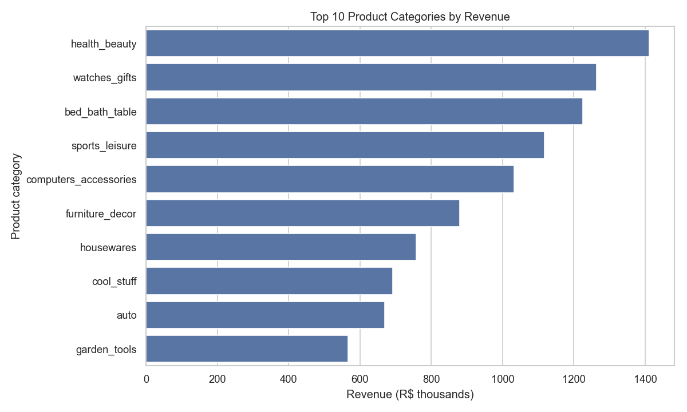
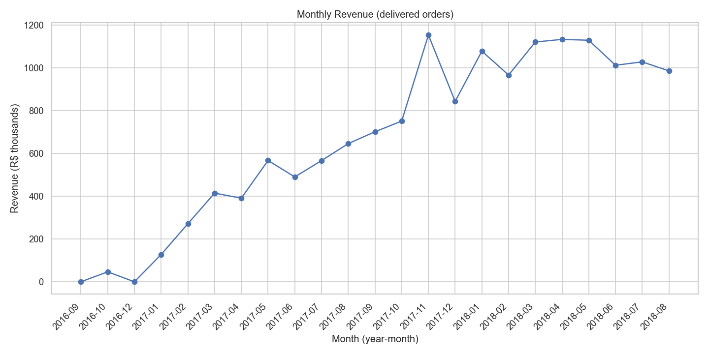
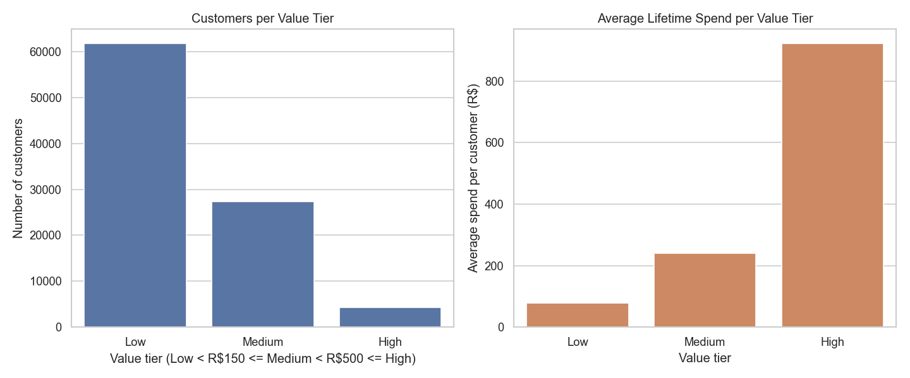
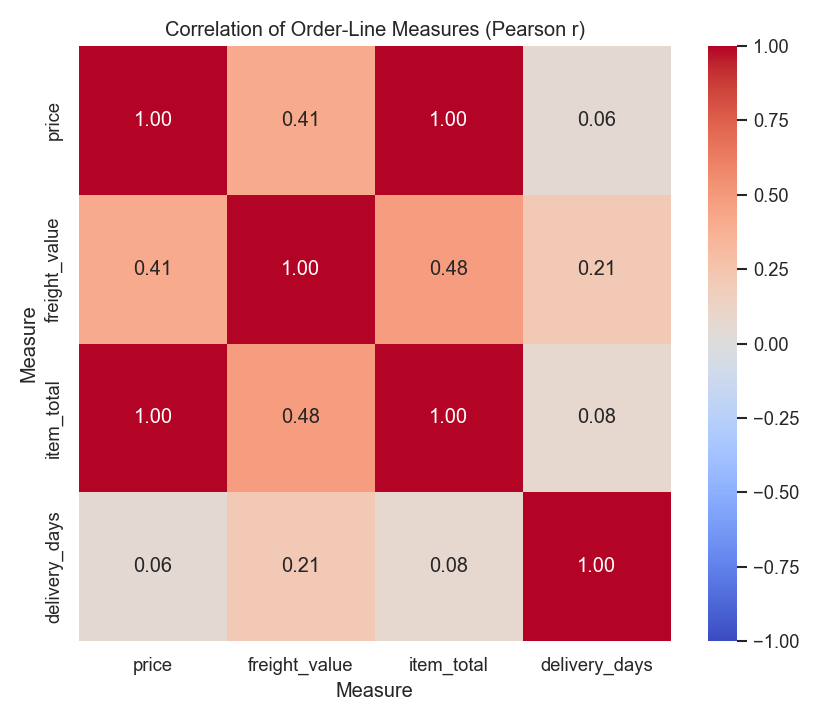

# E-Commerce Sales Analytics: Data Warehouse & EDA Pipeline

## 1. Project overview

This project builds a small analytics data warehouse end to end: it cleans raw e-commerce CSVs, models them as a star schema, pre-aggregates summary marts, answers six business questions in SQL and produces EDA charts.
The data is the public [Brazilian E-Commerce dataset by Olist](https://www.kaggle.com/datasets/olistbr/brazilian-ecommerce) (~100k orders, 2016–2018).
It uses plain Python (pandas, numpy, matplotlib, seaborn) and SQL in DuckDB, an in-process analytical database that lives in a single file, so there's no server, cloud or orchestration tool.

## 2. Architecture

```
Raw CSVs ──► [pandas cleaning] ──► staging tables ──► [SQL] ──► star schema ──► marts ──► analysis + charts
 data/raw     01_ingest_clean.py     stg_* (5)        02_build_warehouse.py  dim_* + fact   03_build_marts.py   04_analysis.py
                                                                             (4 tables)      mart_* (3)          05_visualize.py
```

Everything lives in one file, `data/warehouse.duckdb`. `run_all.py` runs the five stages in order.

## 3. Star schema

```
                 ┌────────────────┐
                 │  dim_dates     │
                 │  date_key (PK) │
                 └───────▲────────┘
                         │
┌────────────────┐  ┌────┴──────────────────┐  ┌────────────────┐
│ dim_customers  │  │  fact_order_items     │  │ dim_products   │
│ customer_key   ◄──┤  order_id, item_id    ├──► product_key    │
│ (PK)           │  │  price, freight_value │  │ (PK)           │
└────────────────┘  │  item_total, delivery │  └────────────────┘
                    └───────────────────────┘
```

- **Fact table:** `fact_order_items`. **Grain: one row per item within an order** (one order line). An order with 3 items has 3 rows. It holds the measurements: `price`, `freight_value`, `item_total`, `delivery_days`, `delivered_late`. It has 110,197 rows.
- **Dimensions** hold the descriptive context you filter and group by:
  - `dim_customers` has one row per **real person**. The key is `customer_unique_id` because Olist's `customer_id` is regenerated for every order. With `customer_id`, every customer would look like a one-time buyer.
  - `dim_products` has one row per product, with the Portuguese and English category names.
  - `dim_dates` has one row per order date, with year, month, quarter, `year_month` and day of week already computed.

**Why a star schema and not one flat table?** A flat table would repeat every customer's city/state and every product's category on each of the ~110k rows. The star schema stores each description once in a dimension. The fact table stays narrow (keys + numbers), and every business question follows the same pattern: *join the fact to the dimensions you need, then group*. Getting the grain explicit also avoids double counting. For example, `delivered_late` is an order-level value repeated on every line, so query Q6 first collapses to one row per order.

## 4. How to run

```bash
pip install -r requirements.txt
```

1. Download the dataset from Kaggle: https://www.kaggle.com/datasets/olistbr/brazilian-ecommerce
2. Unzip it and put these 5 files in `data/raw/`:
   `olist_orders_dataset.csv`, `olist_order_items_dataset.csv`, `olist_customers_dataset.csv`, `olist_products_dataset.csv`, `product_category_name_translation.csv`
3. Run the full pipeline (takes about 10 seconds):

```bash
python run_all.py
```

Each stage can also be run on its own, e.g. `python src/04_analysis.py`. If a file is missing or a table comes out empty, the script stops with a clear error.

## 5. Key findings

All numbers below come from the pipeline output (delivered orders only; revenue = price + freight).

- **Scale:** R$15.42M revenue from **96,478 delivered orders** placed by **93,358 unique customers**.
- **Category concentration:** the top 10 of 72 categories bring in **62.4%** of revenue. `health_beauty` leads with R$1.41M (9.2%), then `watches_gifts` (8.2%) and `bed_bath_table` (7.95%).
- **Very low retention:** only **3.0%** of customers (2,801) ever ordered twice. Repeat customers spend *less* per order (R$145.95 vs R$160.73) but about **1.9× more over their lifetime** (R$308.53 vs R$160.73).
- **Seasonality:** November 2017 (Black Friday) revenue jumped **+53.6%** month over month to R$1.15M, the highest month in the data. December then fell **−26.9%**, the worst drop.
- **Delivery:** **8.1%** of orders arrived after the promised date (average delivery 12.1 days). Some north-eastern states are far worse: **Alagoas 23.9%** and **Maranhão 19.6%**, 2–3× the national rate.
- **Customer value:** the High tier (≥ R$500) is just **4.6%** of customers but **25.5%** of revenue.

### Charts (`outputs/charts/`)

| | |
|---|---|
|  |  |
|  |  |

## 6. SQL techniques used

| Technique | Used here to… |
|---|---|
| **CTEs** (`WITH`) | break queries into readable steps, e.g. computing `LAG` first and then growth %, or a grand total for percent-of-total (Q1) |
| **`RANK()`** | rank categories by revenue (`mart_sales_by_category`) and products within each category with `PARTITION BY` (Q5) |
| **`ROW_NUMBER()`** | pick exactly one most-recent city/state per customer (`dim_customers`) and an exact top-10 of customers (Q3) |
| **`LAG()`** | fetch the previous month's revenue to compute month-over-month growth (`mart_monthly_sales`) |
| **`CASE`** | assign value tiers (High/Medium/Low) and label customers repeat vs one-time (Q4) |
| **JOINs** | `INNER JOIN` builds the fact table so every row has a valid order and customer; `LEFT JOIN` keeps products that have no English translation |
| **`GROUP BY` / `HAVING`** | aggregate per group; `HAVING COUNT(*) >= 100` filters out states with too few orders *after* grouping (Q6) |
| **Aggregates** | `SUM`, `COUNT(DISTINCT)`, `AVG`, `MIN`/`MAX`; `AVG` of a 0/1 flag gives a rate directly |
| **Date functions** | `EXTRACT`, `STRFTIME` build `dim_dates`; `DATE_DIFF` computes customer tenure |
| **`NULLIF` / `COALESCE`** | avoid divide-by-zero in growth %; default missing category translations to `'unknown'` |

## 7. Known limitations

- **`item_total` vs `price` correlation.** The heatmap shows r ≈ 1.00 between `item_total` and `price`. That's an artifact: `item_total = price + freight_value` is derived from price, so it isn't an insight.
- **Delivered orders only.** 2,963 non-delivered orders (cancelled, unavailable, still shipping…) are excluded. That's right for "completed sales", but the data can't answer questions about cancellations or the sales funnel.
- **Heuristic value tiers.** The High (≥ R$500) and Medium (≥ R$150) thresholds were picked by looking at the spend distribution. They are round numbers, not exact percentiles: the actual 60th and 90th percentiles of customer spend are R$133 and R$318, so "High" is closer to the top 5%.
- **Sparse edges of the timeline.** Sep–Dec 2016 has only a few orders (none in Nov 2016), so month-over-month growth there is meaningless. Q2 only ranks months whose previous month had at least R$100k revenue. Because `LAG` takes the previous *row*, a missing month means comparing against two months back.
- **Order-level values on an item-level fact.** `delivery_days` and `delivered_late` belong to the order but are repeated on each line. Order-level questions must first deduplicate to one row per order (as Q6 does).
- **Untranslated categories.** 13 products have a Portuguese category with no English translation, and 610 have no category at all. Both show as `'unknown'`.

## Repository layout

```
ecommerce-analytics/
├── data/raw/                  # the 5 CSVs (gitignored)
├── data/warehouse.duckdb      # generated database (gitignored)
├── src/01_ingest_clean.py … 05_visualize.py
├── sql/schema.sql, marts.sql, analysis_queries.sql
├── outputs/charts/            # generated PNGs
└── run_all.py
```
